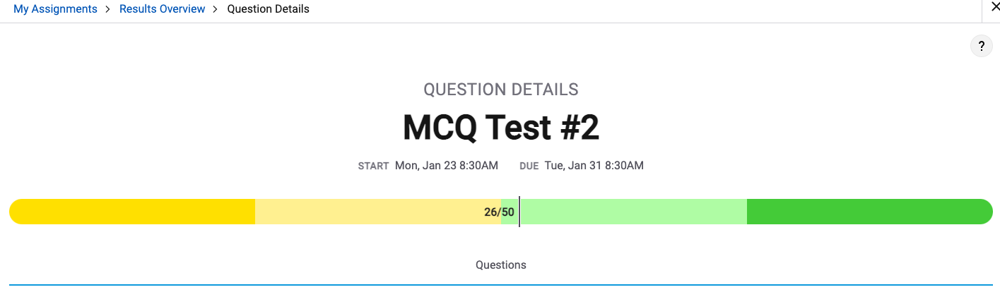
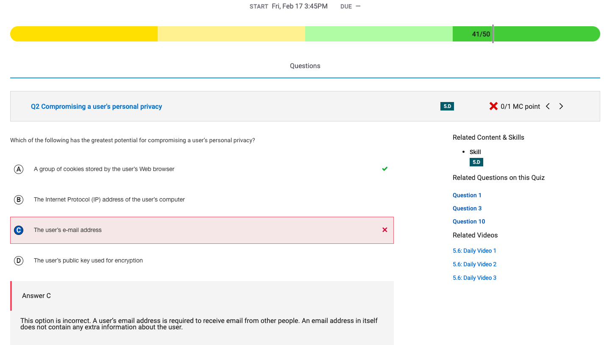
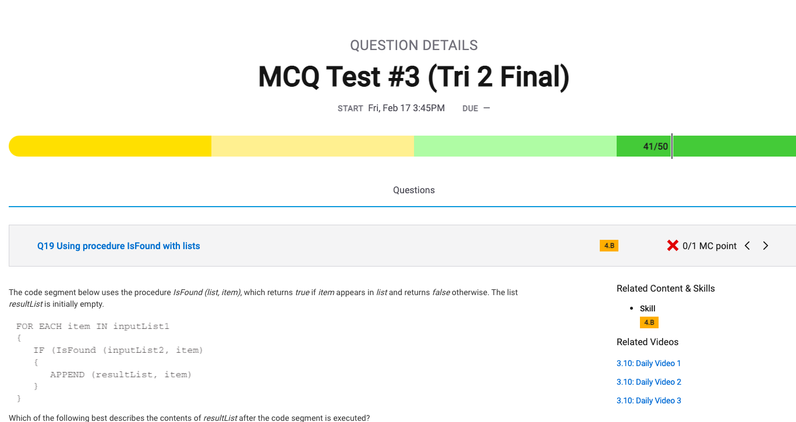

**SCORE**

I got a 41/50 on the final tri 2 test on collegeboard. I think this is pretty decent for myself but I got help from my friends and had to search up multiple problems from the internet. 

I got this question wrong because I didn't realize that cookies could track the users information and store information that they use.

This question is trying to teach you that a lot of information on the internet can show your valuable data.

This question is trying to show how different inputs can show different lists. I got this one wrong because I thought it went in list one and not the result list.

Review:

